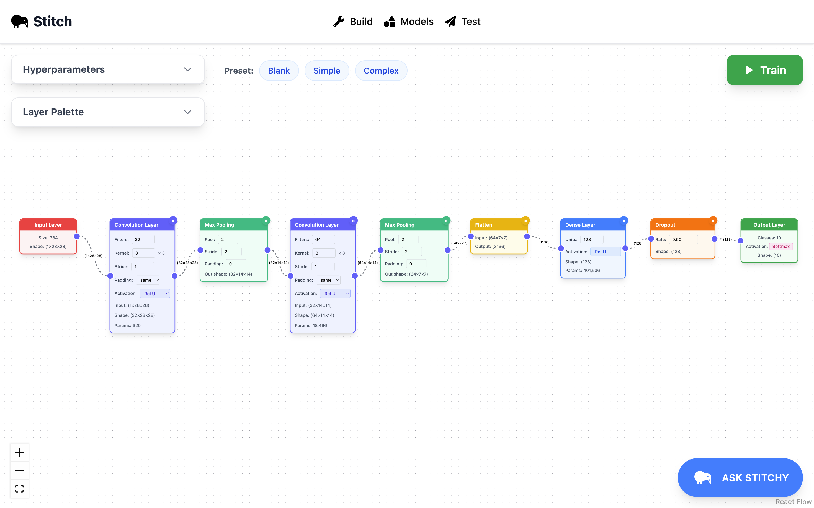

# Stitch - Scratch for Neural Networks

*Build and train Neural Nets with a drag and drop interface and tons of help along the way*

Stitch lets users drag and drop neural network components to build their own model for predicting handwritten digits. With simple buttons and menus, users can train their model on the MNIST dataset, view training performance over time, and test the model on their personally handdrawn input.




<details open>
<summary>Some project demos</summary>

<br/>

https://github.com/user-attachments/assets/76c64938-8d4b-4777-9c71-da08a28c275f

https://github.com/user-attachments/assets/25dc1bfb-97b5-47cb-adf6-0ad0ade2a891

https://github.com/user-attachments/assets/ff7f826a-e24c-4a10-b5f4-20c6ded1bdb5
</details>


Check out the [Devpost page](https://devpost.com/software/stitch-60vxhj)!

## At a Glance

- **Frontend**: React 19 + Vite + Tailwind + React Flow for rich network visualizations.
- **Backend**: FastAPI + PyTorch for model management, training, and inference.
- **Storage**: Lightweight file system persistence (pickled PyTorch models plus JSON metadata).
- **Tooling**: npm for front-end dependencies, pip for Python, and React Query for data fetching.

## Repository Layout

```
.
├── backend/                # Flask api code
│   ├── api.py              # App entry point & route registration
│   ├── controllers/        # Request handlers
│   ├── services/           # Training/inference logic (PyTorch)
│   ├── saved_models/       # Serialized model checkpoints (*.pkl)
│   └── requirements.txt    # Python dependency list
├── frontend/               # React client
│   ├── public/             # Static assets (SVGs, favicons)
│   ├── src/                # Application source
│   │   ├── components/     # Reusable UI and visualization pieces
│   │   ├── hooks/          # Data fetching & model hooks
│   │   └── routes/         # Page-level components
│   └── package.json        # Front-end scripts & dependencies
├── .env
└── README.md
```

## Quick Start

Clone the repo and install both stacks:

```bash
git clone https://github.com/MikaVohl/Stitch
cd Stitch
```

### Backend Setup

```bash
cd backend
python -m venv .venv
source .venv/bin/activate         # Windows: .venv\Scripts\activate
pip install -r requirements.txt
```

Then start the API:

```bash
python api.py
```

### Frontend Setup

```bash
cd frontend
npm install
npm dev
```

## Environment Variables

```bash
export OPENAI_API_KEY=sk-proj-...
```

## Key Features

- **Model Catalog**: Browse trained models, inspect architecture layers, and jump straight to testing with deep links (`/test/:modelId`).
- **Interactive Drawing Grid**: Draw digits with a pixel brush; the UI flattens and normalizes them to MNIST format before inference.
- **Visualization**: React Flow graph showing:
  - 28×28 input pixel nodes
  - Sampled convolutions & dense layers
  - Operations (max pool, dropout, flatten) as labeled boxes
  - Highlighted output neuron corresponding to the latest prediction
- **Inference Runner**: Converts the canvas drawing to a tensor, calls `/api/infer`, and surfaces predictions inline, lighting up the relevant output node.
- **Training Hooks**: Model metadata includes hyperparameters, runs, and saved checkpoints; the backend service abstracts loading, training, and inference.
